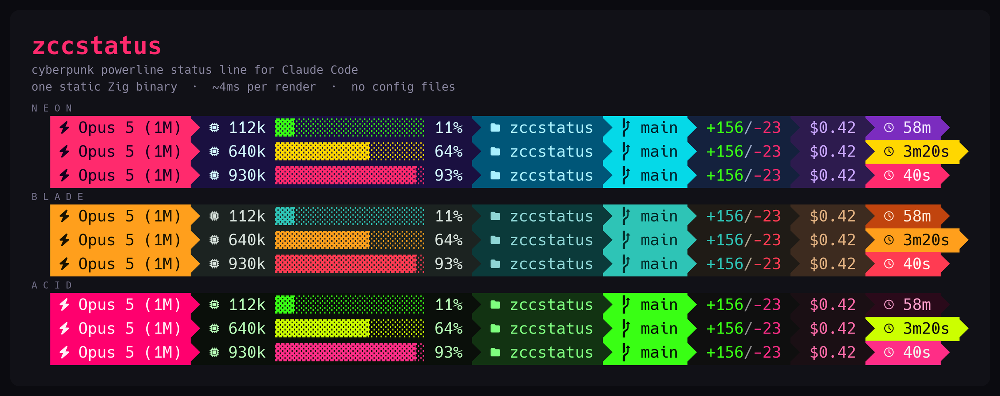

# zccstatus

A cyberpunk powerline status line for [Claude Code](https://claude.com/claude-code).
One static Zig binary. It reads the status JSON on stdin, writes one line of
ANSI to stdout, and exits.



## Why

The usual status lines start a Node process on every render. Claude Code can
re-render several times a second, so that cost is paid constantly.

| | zccstatus | `bunx ccstatusline` |
|---|---|---|
| Per render | **~4 ms** | ~443 ms |
| Size | 300 KB | Node plus a package tree |
| Dependencies | none | Node, npm |
| Config file | none | yes |

Median of 200 runs against 10, same machine, same transcript, same payload.
About 100x. Reproduce it with the numbers in `scripts/`, not by trusting this
table.

## Install

```sh
curl -fsSL https://raw.githubusercontent.com/hexsprite/zccstatus/main/install.sh | sh
```

The installer picks the build for your platform, checks the SHA-256, and puts
the binary in `~/.local/bin`. It then offers to wire it into Claude Code for
you. Prebuilt binaries exist for macOS on Apple silicon and Intel, and Linux on
x86-64 and ARM64.

You need a [Nerd Font](https://www.nerdfonts.com/) for the icons. Any Powerline
font draws the separators, but only a Nerd Font has the glyphs.

### By hand

Add this to `~/.claude/settings.json`:

```json
"statusLine": {
  "type": "command",
  "command": "/Users/you/.local/bin/zccstatus --theme neon",
  "padding": 0,
  "refreshInterval": 5
}
```

**`refreshInterval` is not optional.** Claude Code re-runs the command on
events, and events stop while you are idle. The cache countdown is time-based,
so without a timer it freezes on its last value. That value is always close to
a full cache lifetime, because the last render happens right after an API turn.
The countdown then looks broken when it is only stale.

## What it shows

| Segment | Meaning |
|---|---|
| Model | Name, plus the window size when it is not the standard 200k |
| Context | Tokens used, a gauge, and a percentage. Green to amber to red |
| Directory | Current working directory |
| Branch | Git branch, or a short object id when detached |
| Lines | Lines added and removed this session |
| Cost | Session cost in dollars |
| Cache | Time left on the prompt cache. The block turns amber under five minutes and red under one |

## Themes

Pick one with `--theme <name>` or the `ZCC_THEME` environment variable.

| Name | Look |
|---|---|
| `neon` | hot magenta, electric cyan, deep indigo |
| `blade` | amber, teal, charcoal |
| `acid` | terminal green, hot pink, black |

Run `zccstatus --demo` to see all three at three levels of context pressure.

There is no config file, by design. A theme is a table of RGB values in
[`src/theme.zig`](src/theme.zig). Fork it and change the numbers.

## Width

Claude Code pipes the output, so neither an ioctl nor `tput cols` can see the
terminal. Claude Code sets `COLUMNS` for exactly this reason, from version
2.1.153. `zccstatus` reads it and lays out to fit.

Given room, the bar spends it: the gauge grows from 8 cells to 16, padding
doubles, and the bar splits into two groups with the tail pushed right. Given
less, it sheds in this order: lines, cost, branch, gauge width, directory. The
model and the countdown are the last two standing.

Claude Code also puts system notifications on the right of the same row, and
they truncate whatever they land on. So the bar keeps 8 columns clear:

```sh
zccstatus --margin 12     # or ZCC_MARGIN=12
```

## Where the numbers come from

Claude Code sends the model, directory, cost, lines changed, and a
`context_window` object on stdin. The context numbers come straight from that
object. They are authoritative and cost no file read.

Older versions of Claude Code do not send `context_window`. Then the window is
inferred from the model id, where a `[1m]` suffix means one million tokens, and
the usage is read from the transcript: the last 256 KB of the file, walked
backward to the newest assistant turn.

Subagent turns are written to the same transcript with `isSidechain: true`.
Those counts belong to the subagent, not to your context, so they are skipped.
Counting them makes the bar lie whenever a subagent runs.

The prompt cache countdown is the only value that still needs the transcript.
It is the cache lifetime minus the time since the newest assistant turn. The
lifetime comes from `cache_creation`: `ephemeral_1h_input_tokens` means one
hour, `ephemeral_5m_input_tokens` means five minutes. A turn that only read
cache carries no lifetime of its own, so the scan looks further back for one.

The git branch is read straight from `.git/HEAD`. No subprocess: a git spawn
would cost more than every other segment together. Worktrees and detached HEAD
both work.

## Failure behavior

A status line that crashes wedges the display, and the only debugging window is
one line tall. So a segment that cannot read its data shows a placeholder or
disappears, a malformed payload still produces a bar, and the exit code is
always 0.

## Build from source

Needs [Zig 0.16](https://ziglang.org/download/).

```sh
zig build -Doptimize=ReleaseFast -Dstrip=true
cp zig-out/bin/zccstatus ~/.local/bin/
```

## Tests

```sh
zig build test        # 40 unit tests
./test/repro-cache.sh # end-to-end against fixture transcripts
```

The render path takes `now` as a parameter and never reads the clock, so the
countdown maths is deterministic.

Two tests are there because they already caught real bugs. One checks the
foreground and background of every segment in every theme for a minimum
luminance gap; it found a countdown rendering pink on pink. The other renders
every width from 30 to 300 columns in all three themes and fails if any result
is wider than the terminal.

## License

MIT
